# 🔐 JML Engine: IAM Lifecycle Automation

*Enterprise-grade IAM automation for Joiner-Mover-Leaver workflows across AWS, Azure, GitHub, Google Workspace, and Slack*

[](https://opensource.org/licenses/MIT)
[](https://www.python.org/downloads/)
[](https://fastapi.tiangolo.com/)
[](https://www.iso.org/standard/54534.html)

---

## 📋 Table of Contents

- [Overview](#-overview)
- [Features](#-features)
- [Architecture](#-architecture)
- [Quick Start](#-quick-start)
- [Installation](#-installation)
- [Configuration](#-configuration)
- [Usage](#-usage)
- [API Reference](#-api-reference)
- [CLI Reference](#-cli-reference)
- [Connectors](#-connectors)
- [Compliance](#-compliance)
- [Development](#-development)
- [Contributing](#-contributing)
- [License](#-license)

---

## 🎯 Overview

The **JML Engine** (Joiner-Mover-Leaver Engine) is a comprehensive IAM lifecycle automation platform that manages the complete employee identity lifecycle across multiple cloud and SaaS platforms. It automatically provisions accounts, manages access entitlements, and ensures compliance with enterprise security policies.

### Key Capabilities

- **🔄 Automated Workflows**: Joiner, Mover, and Leaver processes with zero-touch automation
- **🔌 Multi-Platform Integration**: AWS IAM, Azure Entra ID, GitHub, Google Workspace, Slack
- **📊 Real-Time Monitoring**: Web dashboard and comprehensive audit logging
- **🛡️ Compliance Ready**: ISO 27001, SOC2, APRA CPS 234, and Essential 8 compliant
- **🔍 Evidence-Based**: Tamper-evident audit trails with integrity verification
- **🏗️ Enterprise Architecture**: Scalable, containerized, and production-ready

---

## ✨ Features

### Core Functionality
- **HR Event Processing**: Automatic ingestion from Workday, BambooHR, CSV, and JSON webhooks
- **Policy-Based Access**: Configurable access matrices and role mappings
- **Workflow Engines**: Specialized automation for Joiners, Movers, and Leavers
- **Audit & Compliance**: Enterprise-grade logging with evidence storage
- **Multi-System Coordination**: Atomic operations across all integrated platforms

### User Interfaces
- **REST API**: FastAPI-based endpoints for integration
- **Web Dashboard**: Streamlit interface for monitoring and management
- **CLI Tool**: Command-line interface for administration and testing
- **Programmatic SDK**: Python SDK for custom integrations

### Security & Compliance
- **Zero-Trust Design**: Least privilege access and need-to-know basis
- **Evidence Integrity**: Cryptographic hashing and tamper detection
- **Regulatory Compliance**: Multi-framework compliance reporting
- **Access Reviews**: Automated entitlement certification workflows

### Enterprise Features
- **High Availability**: Containerized deployment with health monitoring
- **Scalability**: Event-driven architecture supporting thousands of users
- **Extensibility**: Plugin architecture for custom connectors
- **Monitoring**: Comprehensive metrics and alerting capabilities

---

## 🏗️ Architecture

### System Architecture Diagram

```mermaid
graph TB
    subgraph "External Systems"
        HR[HR Systems<br/>Workday, BambooHR, CSV]
        AWS[AWS IAM]
        AZURE[Azure Entra ID]
        GITHUB[GitHub]
        GOOGLE[Google Workspace]
        SLACK[Slack]
    end

    subgraph "JML Engine Core"
        INGEST[HR Event Ingestion]
        WORKFLOWS[Workflow Engines<br/>Joiner • Mover • Leaver]
        POLICY[Policy Engine<br/>Access Matrix • Role Mappings]
        STATE[State Management<br/>Identity Store]
        CONNECTORS[Platform Connectors<br/>AWS • Azure • GitHub • Google • Slack]
        AUDIT[Audit & Compliance<br/>Evidence Store • Reports]
    end

    subgraph "Management Interfaces"
        API[REST API<br/>FastAPI]
        DASHBOARD[Web Dashboard<br/>Streamlit]
        CLI[CLI Tool<br/>jmlctl]
    end

    HR --> INGEST
    INGEST --> WORKFLOWS
    WORKFLOWS --> POLICY
    WORKFLOWS --> STATE
    WORKFLOWS --> CONNECTORS
    WORKFLOWS --> AUDIT

    CONNECTORS --> AWS
    CONNECTORS --> AZURE
    CONNECTORS --> GITHUB
    CONNECTORS --> GOOGLE
    CONNECTORS --> SLACK

    API --> WORKFLOWS
    DASHBOARD --> STATE
    DASHBOARD --> AUDIT
    CLI --> WORKFLOWS
    CLI --> STATE
    CLI --> AUDIT
```



### Data Flow Diagram


### Component Overview

| Component | Purpose | Technology | Key Features |
|-----------|---------|------------|--------------|
| **HR Ingestion** | Parse and normalize HR events from multiple sources | Python/Pydantic | Auto-detection, validation, error handling |
| **Workflow Engine** | Execute JML automation logic with rollback | Python/Async | Atomic operations, error recovery, audit trails |
| **Connectors** | Platform-specific integrations with mock/real modes | AWS Boto3, REST APIs | Connection pooling, retry logic, rate limiting |
| **Policy Engine** | Access entitlement resolution and validation | YAML/Python | Role-based access, least privilege, policy versioning |
| **State Management** | Identity and entitlement tracking with persistence | JSON/In-Memory | Transactional updates, conflict resolution, backup |
| **Audit System** | Compliance logging with tamper-evident evidence | JSON/Crypto | Integrity hashing, retention policies, compliance reports |
| **API Server** | REST endpoints with authentication and rate limiting | FastAPI | OpenAPI docs, async processing, CORS support |
| **Dashboard** | Web interface for monitoring and management | Streamlit | Real-time updates, interactive charts, role-based access |
| **CLI Tool** | Command-line administration and testing | Click/Rich | Shell completion, colored output, batch operations |

---

## 🚀 Quick Start

### Prerequisites
- Python 3.8+
- Docker & Docker Compose (optional)
- AWS/Azure/GitHub API credentials (for real integrations)

### 1. Clone and Install

```bash
git clone <repository-url>
cd jml_engine
pip install -r requirements.txt
```

### 2. Configure Access Policies

Edit the access matrix and role mappings:

```bash
# Customize access policies
vim engine/access_matrix.yaml
vim engine/role_mappings.yaml
```

### 3. Run with Mock Mode

```bash
# Start the API server
python -m jml_engine.api.server

# In another terminal, start the dashboard
streamlit run jml_engine/dashboard/app.py
```

### 4. Test a Joiner Workflow

```bash
# Use the CLI to simulate a new hire
jmlctl simulate --event-type NEW_STARTER

# Process an HR event from file
jmlctl process-event hr_event.json
```

### 5. Access Interfaces

- **API**: http://localhost:8000
- **Dashboard**: http://localhost:8501
- **CLI**: `jmlctl --help`

---

## 📦 Installation

### Option 1: Docker Deployment (Recommended)

```bash
# Clone repository
git clone <repository-url>
cd jml_engine

# Start all services
docker-compose up -d

# View logs
docker-compose logs -f
```

### Option 2: Local Development

```bash
# Install dependencies
pip install -r requirements.txt

# Install the package
pip install -e .

# Run tests
pytest tests/
```

### Option 3: Production Deployment

```bash
# Build production images
docker build -f Dockerfile.api -t jml-engine-api .
docker build -f Dockerfile.dashboard -t jml-engine-dashboard .

# Deploy with orchestration (Kubernetes, etc.)
kubectl apply -f k8s/
```

---

## ⚙️ Configuration

### Environment Variables

| Variable | Description | Default |
|----------|-------------|---------|
| `MOCK_MODE` | Use mock connectors instead of real APIs | `true` |
| `AUDIT_DIR` | Directory for audit logs and evidence | `./audit` |
| `STATE_FILE` | Path to identity state file | `./data/state.json` |
| `API_HOST` | API server bind address | `0.0.0.0` |
| `API_PORT` | API server port | `8000` |

### Connector Configuration

Create a `config.json` file:

```json
{
  "connectors": {
    "aws": {
      "aws_access_key_id": "AKIA...",
      "aws_secret_access_key": "secret...",
      "region": "us-east-1"
    },
    "github": {
      "token": "ghp_...",
      "organization": "mycompany"
    },
    "slack": {
      "token": "xoxb-...",
      "workspace_id": "T123456"
    }
  },
  "mock_mode": false,
  "audit_dir": "/var/log/jml",
  "state_file": "/var/lib/jml/state.json"
}
```

### Access Matrix Configuration

The `engine/access_matrix.yaml` defines baseline access for each department:

```yaml
default_access:
  aws_roles: ["ReadOnlyAccess"]
  azure_groups: ["All Employees"]
  github_teams: ["employees"]

departments:
  Engineering:
    aws_roles: ["EC2ReadOnly", "DevOpsRole"]
    github_teams: ["engineering", "dev-team"]
```

---

## 📖 Usage

### Processing HR Events

#### Via API
```bash
curl -X POST http://localhost:8000/event/hr \
  -H "Content-Type: application/json" \
  -d '{
    "event": "NEW_STARTER",
    "employee_id": "EMP001",
    "name": "John Smith",
    "email": "john.smith@company.com",
    "department": "Engineering",
    "title": "Software Engineer"
  }'
```

#### Via CLI
```bash
jmlctl process-event hr_event.json
```

### Workflow Simulation

```bash
# Simulate a new hire
jmlctl simulate

# Simulate with specific parameters
jmlctl simulate --event-type ROLE_CHANGE --employee-id EMP002
```

### User Management

```bash
# List all users
jmlctl list-users

# Show specific user details
jmlctl show-user EMP001

# View user audit trail
jmlctl audit-trail EMP001
```

### System Monitoring

```bash
# View system statistics
jmlctl stats

# Start API server
jmlctl serve

# Generate compliance report
jmlctl compliance-report --start-date 2024-01-01 --end-date 2024-01-31
```

---

## 🌐 API Reference

### Core Endpoints

| Method | Endpoint | Description |
|--------|----------|-------------|
| `GET` | `/health` | System health check |
| `POST` | `/event/hr` | Process HR event |
| `GET` | `/user/{id}` | Get user identity |
| `GET` | `/users` | List user identities |
| `GET` | `/audit` | Get audit logs |
| `POST` | `/simulate/{type}` | Simulate workflow |
| `GET` | `/stats` | System statistics |

### HR Event Processing

**Request Body:**
```json
{
  "event": "NEW_STARTER",
  "employee_id": "string",
  "name": "string",
  "email": "string",
  "department": "string",
  "title": "string",
  "manager_email": "string",
  "start_date": "2024-01-15",
  "end_date": "string",
  "location": "string",
  "contract_type": "PERMANENT",
  "previous_department": "string",
  "previous_title": "string"
}
```

**Response:**
```json
{
  "workflow_id": "string",
  "employee_id": "string",
  "event_type": "NEW_STARTER",
  "status": "accepted",
  "started_at": "2024-01-15T10:30:00Z",
  "completed_at": null,
  "success": true,
  "total_steps": 0,
  "successful_steps": 0,
  "failed_steps": 0,
  "errors": []
}
```

---

## 💻 CLI Reference

### Global Options

```bash
jmlctl [OPTIONS] COMMAND [ARGS]...

Options:
  --config, -c PATH    Path to configuration file
  --mock/--real        Use mock or real API connections
  --help               Show this message and exit
```

### Commands

#### `process-event`
Process an HR event from a JSON file.

```bash
jmlctl process-event [OPTIONS] EVENT_FILE

Options:
  --help  Show this message and exit
```

#### `simulate`
Simulate an HR event for testing.

```bash
jmlctl simulate [OPTIONS]

Options:
  --event-type [NEW_STARTER|ROLE_CHANGE|TERMINATION]
  --employee-id TEXT
  --name TEXT
  --email TEXT
  --department TEXT
  --title TEXT
  --help                    Show this message and exit
```

#### `show-user`
Display user identity information.

```bash
jmlctl show-user [OPTIONS] EMPLOYEE_ID

Options:
  --help  Show this message and exit
```

#### `list-users`
List user identities with filtering.

```bash
jmlctl list-users [OPTIONS]

Options:
  --department TEXT    Filter by department
  --status TEXT        Filter by status
  --limit INTEGER      Maximum results
  --help               Show this message and exit
```

#### `audit-trail`
Show audit trail for a user.

```bash
jmlctl audit-trail [OPTIONS] EMPLOYEE_ID

Options:
  --days INTEGER  Days to look back
  --help          Show this message and exit
```

#### `stats`
Display system statistics.

```bash
jmlctl stats [OPTIONS]

Options:
  --help  Show this message and exit
```

#### `compliance-report`
Generate compliance report.

```bash
jmlctl compliance-report [OPTIONS]

Options:
  --start-date TEXT    Start date (YYYY-MM-DD)
  --end-date TEXT      End date (YYYY-MM-DD)
  --frameworks TEXT    Frameworks (comma-separated)
  --help               Show this message and exit
```

#### `serve`
Start the API server.

```bash
jmlctl serve [OPTIONS]

Options:
  --port INTEGER  Port to bind to
  --host TEXT     Host to bind to
  --help          Show this message and exit
```

---

## 🔌 Connectors

### AWS IAM Connector

**Configuration:**
```json
{
  "aws_access_key_id": "AKIA...",
  "aws_secret_access_key": "secret...",
  "region": "us-east-1"
}
```

**Capabilities:**
- User account creation/deletion
- IAM role and policy assignment
- Access key management
- Group membership

### Azure Entra ID Connector

**Configuration:**
```json
{
  "subscription_id": "sub-uuid",
  "tenant_id": "tenant-uuid"
}
```

**Capabilities:**
- User lifecycle management
- Security group assignment
- Role-based access control
- Directory integration

### GitHub Connector

**Configuration:**
```json
{
  "token": "ghp_...",
  "organization": "mycompany"
}
```

**Capabilities:**
- Organization membership
- Team assignment
- Repository access control
- PAT token management

### Google Workspace Connector

**Configuration:**
```json
{
  "credentials_path": "service-account.json",
  "domain": "company.com",
  "domain_admin": "admin@company.com"
}
```

**Capabilities:**
- User account provisioning
- Group membership
- Organizational unit assignment
- Profile management

### Slack Connector

**Configuration:**
```json
{
  "token": "xoxb-...",
  "workspace_id": "T123456"
}
```

**Capabilities:**
- Workspace membership
- Channel access
- Role assignment
- Profile management

---

## 🛡️ Compliance

### Supported Frameworks

| Framework | Status | Description |
|-----------|--------|-------------|
| **ISO 27001** | ✅ | Information security management |
| **SOC 2** | ✅ | Trust services criteria |
| **APRA CPS 234** | ✅ | Information security requirements |
| **Essential 8** | ✅ | Australian Signals Directorate |

### Audit Evidence

The JML Engine generates tamper-evident audit evidence for all operations:

- **Integrity Verification**: SHA-256 hashing of all evidence
- **Chain of Custody**: Timestamped evidence with metadata
- **Retention**: 7-year retention for compliance evidence
- **Export**: Evidence packages for external audits

### Compliance Reporting

```bash
# Generate ISO 27001 compliance report
jmlctl compliance-report --frameworks ISO_27001

# Generate multi-framework report
jmlctl compliance-report \
  --start-date 2024-01-01 \
  --end-date 2024-03-31 \
  --frameworks "ISO_27001,SOC2,APRA_CPS_234"
```

---

## 🧪 Development

### Testing

```bash
# Run all tests
pytest tests/

# Run with coverage
pytest --cov=jml_engine --cov-report=html

# Run specific test file
pytest tests/test_joiner.py
```

### Development Setup

```bash
# Install development dependencies
pip install -r requirements.txt
pip install -e ".[dev]"

# Run linting
black jml_engine/
isort jml_engine/
flake8 jml_engine/

# Run type checking
mypy jml_engine/
```

### Adding New Connectors

1. Create connector class inheriting from `BaseConnector`
2. Implement required methods: `create_user`, `delete_user`, etc.
3. Add mock implementation inheriting from `MockConnector`
4. Register connector in `connectors/__init__.py`
5. Add configuration schema
6. Update documentation

### Extending Workflows

1. Create new workflow class inheriting from `BaseWorkflow`
2. Implement `execute()` method
3. Add workflow-specific steps in `_execute_provisioning_steps()`
4. Register workflow in workflow helpers
5. Add API endpoints and CLI commands

---

## 🤝 Contributing

We welcome contributions! Please see our [Contributing Guide](CONTRIBUTING.md) for details.

### Development Workflow

1. Fork the repository
2. Create a feature branch: `git checkout -b feature/amazing-feature`
3. Make your changes and add tests
4. Run the test suite: `pytest`
5. Commit your changes: `git commit -m 'Add amazing feature'`
6. Push to the branch: `git push origin feature/amazing-feature`
7. Open a Pull Request

### Code Standards

- **Python**: PEP 8 with Black formatting
- **Documentation**: Google-style docstrings
- **Testing**: pytest with minimum 80% coverage
- **Linting**: flake8 and mypy for type checking

---

## 📄 License

This project is licensed under the MIT License - see the [LICENSE](LICENSE) file for details.

---

## 🙏 Acknowledgments

- **FastAPI**: For the excellent web framework
- **Streamlit**: For the beautiful dashboard framework
- **AWS Boto3, Azure SDKs**: For cloud platform integrations
- **The Open Source Community**: For the amazing tools and libraries

---

## 📞 Support

- **Documentation**: [Full Documentation](https://jml-engine.readthedocs.io/)
- **Issues**: [GitHub Issues](https://github.com/yourusername/jml-engine/issues)
- **Discussions**: [GitHub Discussions](https://github.com/yourusername/jml-engine/discussions)
- **Email**: team@jml-engine.dev

---

*Built with ❤️ for enterprise IAM automation*
